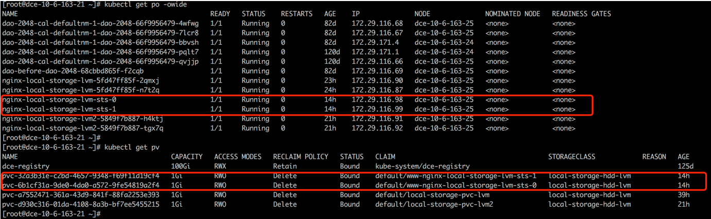

# FAQs

### Q1: How does HwameiStor scheduler work in Kubernetes platform? 

hwameiStor scheduler is deployed as pod in hwameiStor namespace.

Once the applications (Deployment or StatefulSet) are created, the pods will be scheduled to the work nodes on which hwameiStor are already configured.

### Q2: How does hwameiStor schedule applications with multi-replicas workloads? What are the differences compare to the traditional shared storage (NFS / block)?

We strongly recommend to use StatefulSet for the applications with multi-replicas workloads.

StatefulSet will deploy replicas on the same work node with the original pod, and will also create a pv data volume for each of replicas.  Upon the needs to deploy replicas on different work nodes, we need to configure with `pod affinity`.

We suggest to use single pod for deployment as the block data volumes can not be shared.

For the traditional shared storage:

StatefulSet will deploy replicas to the other work nodes for workload distribution and will also create a pv data volume for each of replicas.

Deployment will also deploy replicas to the other work nodes for workload distribution, but will share the same pv data volume (only for NFS). We suggest to use a single pod for block storage because the block data volumes can not be shared.

END.
