# HwameiStor 能力、安全及运维测试

本次测试环境为 Kubernetes 1.22，对接 HwameiStor 本地存储后，成功部署 TiDB 1.3，随后执行数据库 SQL 基本能力测试、系统安全测试及运维管理测试。

全部测试成功通过，证实 HwameiStor 能够完美支撑 TiDB 这类高可用、强一致要求较高、数据规模较大的分布式数据库应用场景。

## TiDB 简介

TiDB 是一款同时支持在线事务处理 (OLTP) 与在线分析处理 (OATP) 的融合型分布式数据库产品，具备水平扩缩容、金融级高可用、实时 HTAP（即同时支持 OLTP 和 OATP）、云原生的分布式数据库，兼容 MySQL 5.7 协议和 MySQL 生态等重要特性。TiDB 的目标是为用户提供一站式的 OLTP、OLAP、HTAP 解决方案，适合高可用、强一致要求较高、数据规模较大等各种应用场景。

### TiDB 整体架构

TiDB 分布式数据库将整体架构拆分成了多个模块，各模块之间互相通信，组成完整的 TiDB 系统。对应的架构图如下：


- **TiDB Server**
  
  SQL 层对外暴露 MySQL 协议的连接端点，负责接受客户端的连接，执行 SQL 解析和优化，最终生成分布式执行计划。TiDB 层本身是无状态的，实践中可以启动多个 TiDB 实例，通过负载均衡组件（如 LVS、HAProxy 或 F5）对外提供统一的接入地址，客户端的连接可以均匀地分摊在多个 TiDB 实例上以达到负载均衡的效果。TiDB Server 本身并不存储数据，只是解析 SQL，将实际的数据读取请求转发给底层的存储节点 TiKV（或 TiFlash）。

- **PD (Placement Driver) Server**
  
  整个 TiDB 集群的元信息管理模块，负责存储每个 TiKV 节点实时的数据分布情况和集群的整体拓扑结构，提供 TiDB Dashboard 管控界面，并为分布式事务分配事务 ID。PD 不仅存储元信息，同时还会根据 TiKV 节点实时上报的数据分布状态，下发数据调度命令给具体的 TiKV 节点，可以说是整个集群的“大脑”。此外，PD 本身也是由至少 3 个节点构成，拥有高可用的能力。建议部署奇数个 PD 节点。

- **存储节点**
	
	- TiKV Server：负责存储数据，从外部看 TiKV 是一个分布式的提供事务的 Key-Value 存储引擎。存储数据的基本单位是 Region，每个 Region 负责存储一个 Key Range（从 StartKey 到 EndKey 的左闭右开区间）的数据，每个 TiKV 节点会负责多个 Region。TiKV 的 API 在 KV 键值对层面提供对分布式事务的原生支持，默认提供了 SI (Snapshot Isolation) 的隔离级别，这也是 TiDB 在 SQL 层面支持分布式事务的核心。TiDB 的 SQL 层做完 SQL 解析后，会将 SQL 的执行计划转换为对 TiKV API 的实际调用。所以，数据都存储在 TiKV 中。另外，TiKV 中的数据都会自动维护多副本（默认为三副本），天然支持高可用和自动故障转移。

	- TiFlash：TiFlash 是一类特殊的存储节点。和普通 TiKV 节点不一样的是，在 TiFlash 内部，数据是以列式的形式进行存储，主要的功能是为分析型的场景加速。

### TiDB 数据库的存储


- **键值对 (Key-Value Pair)**

  TiKV 的选择是 Key-Value 模型，并且提供有序遍历方法。TiKV 数据存储的两个关键点：

  - 这是一个巨大的 Map（可以类比一下 C++ 的 std::map），也就是存储的是 Key-Value Pairs。

  - 这个 Map 中的 Key-Value pair 按照 Key 的二进制顺序有序，也就是可以 Seek 到某一个 Key 的位置，然后不断地调用 Next 方法以递增的顺序获取比这个 Key 大的 Key-Value。

- **本地存储（Rocks DB）**
  
  任何持久化的存储引擎，数据终归要保存在磁盘上，TiKV 也不例外。但是 TiKV 没有选择直接向磁盘上写数据，而是把数据保存在 RocksDB 中，具体的数据落地由 RocksDB 负责。这样做的原因是开发一个单机存储引擎工作量很大，特别是要做一个高性能的单机引擎，需要做各种细致的优化，而 RocksDB 是由 Facebook 开源的一个非常优秀的单机 KV 存储引擎，可以满足 TiKV 对单机引擎的各种要求。这里可以简单地认为 RocksDB 是一个单机的持久化 Key-Value Map。

- **Raft 协议**
  
  TiKV 选择了 Raft 算法来保证单机失效的情况下数据不丢失不出错。简单来说，就是把数据复制到多台机器上，这样某一台机器无法提供服务时，其他机器上的副本还能提供服务。这个数据复制方案可靠并且高效，能处理副本失效的情况。

- **Region**
  
  TiKV 选择了按照 Key 划分 Range。某一段连续的 Key 都保存在一个存储节点上。将整个 Key-Value 空间分成很多段，每一段是一系列连续的 Key，称为一个 Region。尽量让每个 Region 中保存的数据不超过一定的大小，目前在 TiKV 中默认是不超过 96MB。每一个 Region 都可以用 [StartKey，EndKey] 这样的左闭右开区间来描述。

- **MVCC**
  
  TiKV实现了多版本并发控制 (MVCC)。

- **分布式 ACID 事务**
  
  TiKV 的事务采用的是 Google 在 BigTable 中使用的事务模型：Percolator。

## 搭建测试环境

### Kubernetes 集群

本次测试使用三台虚拟机节点部署 Kubernetes 集群，包括 1 个 master 节点和 2 个 worker节点。Kubelete 版本为 1.22.0。

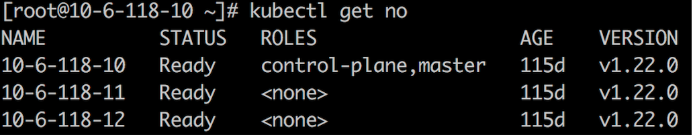

### HwameiStor 本地存储

1. 在 Kubernetes 集群上部署 HwameiStor 本地存储

   

2. 在两台 worker 节点上分别为 HwameiStor 配置一块 100G 的本地磁盘 sdb

   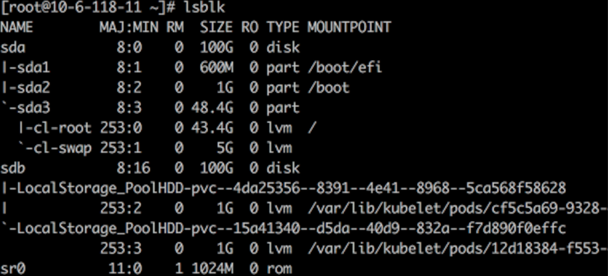

   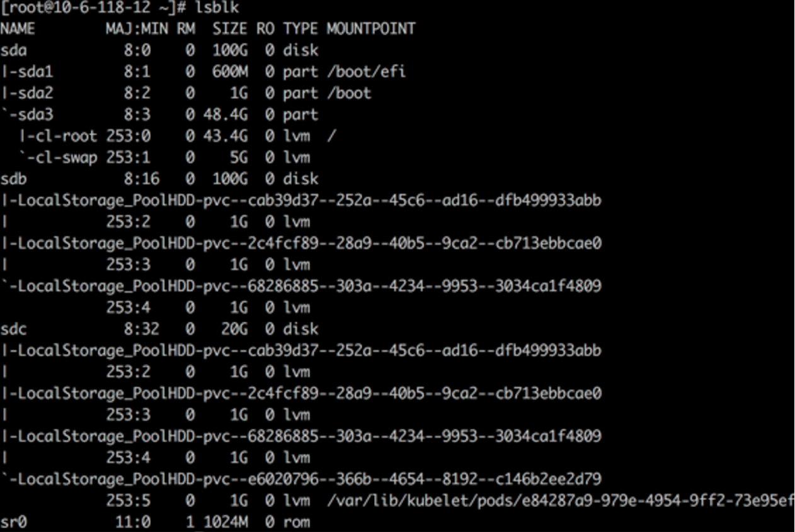

3. 创建 storagClass

   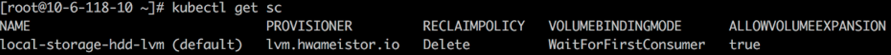

### 在 Kubernetes 上部署 TiDB

可以使用 TiDB Operator 在 Kubernetes 上部署 TiDB。TiDB Operator 是 Kubernetes 上的 TiDB 集群自动运维系统，提供包括部署、升级、扩缩容、备份恢复、配置变更的 TiDB 全生命周期管理。借助 TiDB Operator，TiDB 可以无缝运行在公有云或私有部署的 Kubernetes 集群上。

TiDB 与 TiDB Operator 版本的对应关系如下：

| TiDB  版本         | 适用的 TiDB Operator 版本 |
| ------------------ | ------------------------- |
| dev                | dev                       |
| TiDB  >= 5.4       | 1.3                       |
| 5.1  <= TiDB < 5.4 | 1.3（推荐），1.2          |
| 3.0  <= TiDB < 5.1 | 1.3（推荐），1.2，1.1     |
| 2.1  <= TiDB < 3.0 | 1.0（停止维护）           |

#### 部署 TiDB Operator

1. 安装 TiDB CRDs

   ```
   kubectl apply -f https://raw.githubusercontent.com/pingcap/tidb-operator/master/manifests/crd.yaml
   ```

2. 安装 TiDB Operator

   ```
   helm repo add pingcap https://charts.pingcap.org/ 
   kubectl create namespace tidb-admin 
   helm install --namespace tidb-admin tidb-operator pingcap/tidb-operator --version v1.3.2 \
   --set operatorImage=registry.cn-beijing.aliyuncs.com/tidb/tidb-operator:v1.3.2 \
   --set tidbBackupManagerImage=registry.cn-beijing.aliyuncs.com/tidb/tidb-backup-manager:v1.3.2 \
   --set scheduler.kubeSchedulerImageName=registry.cn-hangzhou.aliyuncs.com/google_containers/kube-scheduler
   ```

3. 检查 TiDB Operator 组件

   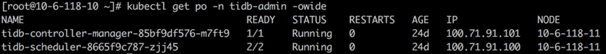

#### 部署 TiDB 集群

```
kubectl create namespace tidb-cluster && \
kubectl -n tidb-cluster apply -f https://raw.githubusercontent.com/pingcap/tidb-operator/master/examples/basic/tidb-cluster.yaml 
kubectl -n tidb-cluster apply -f https://raw.githubusercontent.com /pingcap/tidb-operator/master/examples/basic/tidb-monitor.yaml
```
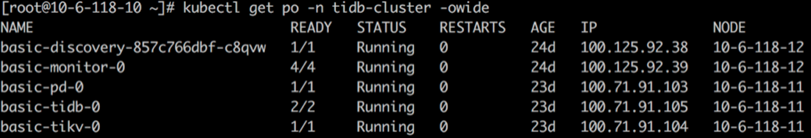

#### 连接 TiDB 集群

```
yum -y install mysql-client
```

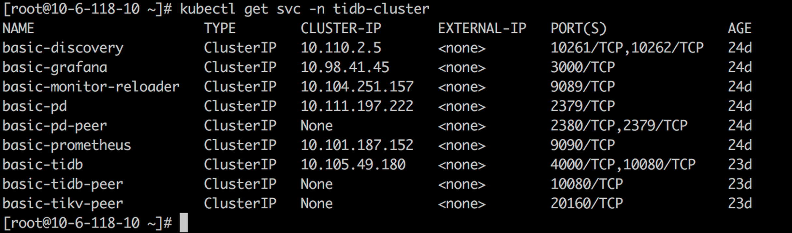

```
kubectl port-forward -n tidb-cluster svc/basic-tidb 4000 > pf4000.out & 
```


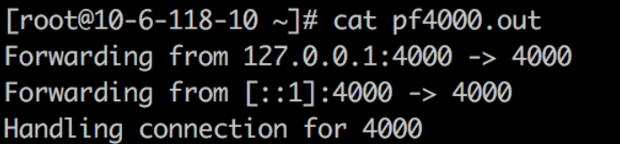

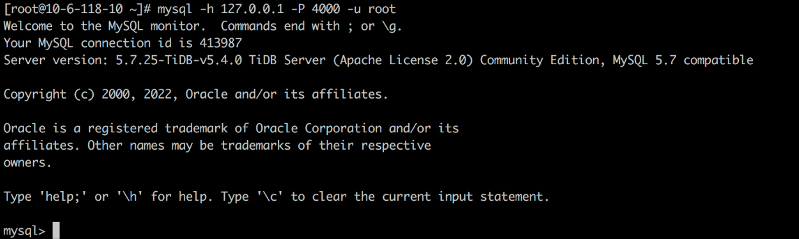

#### 检查并验证 TiDB 集群状态

1. 创建 Hello_world 表

   ```
   create table hello_world (id int unsigned not null auto_increment primary key, v varchar(32)); 
   ```
   

2. 查询 TiDB 版本号

   ```
   select tidb_version()\G;
   ```
   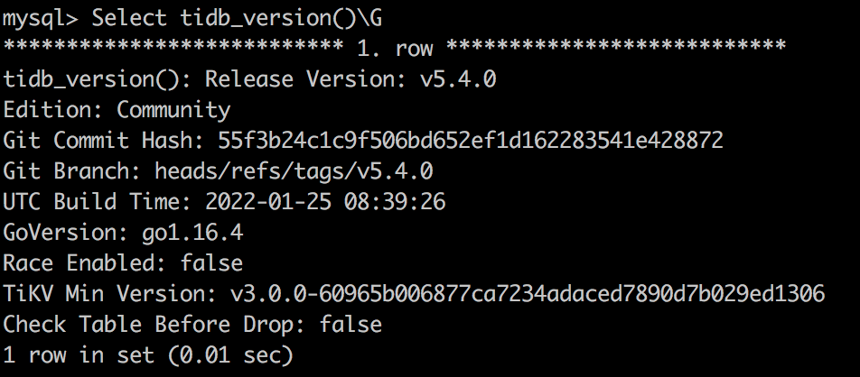

3. 查询 Tikv 存储状态

   ```
   select * from information_schema.tikv_store_status\G;
   ```
   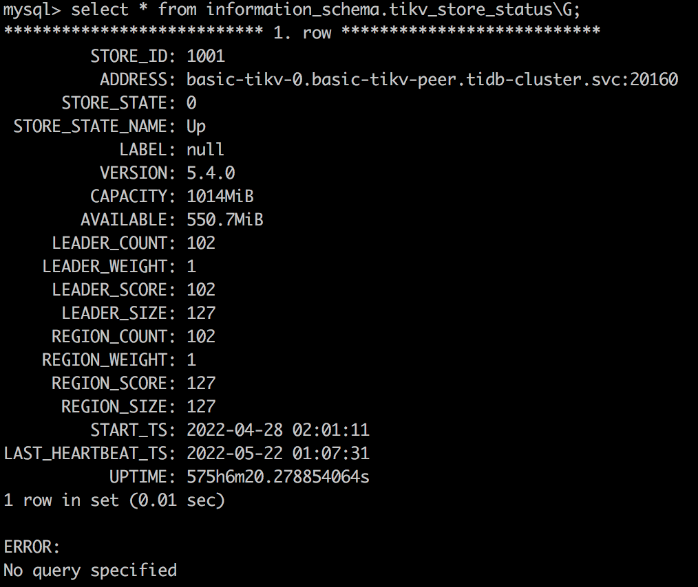


#### HwameiStor 存储配置

从 `storageClass local-storage-hdd-lvm` 分别为 tidb-tikv 及 tidb-pd 创建一个 PVC:

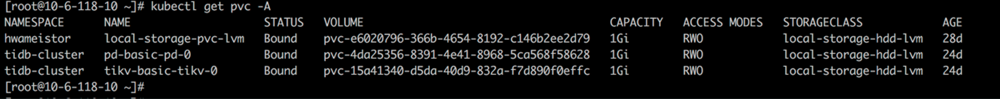

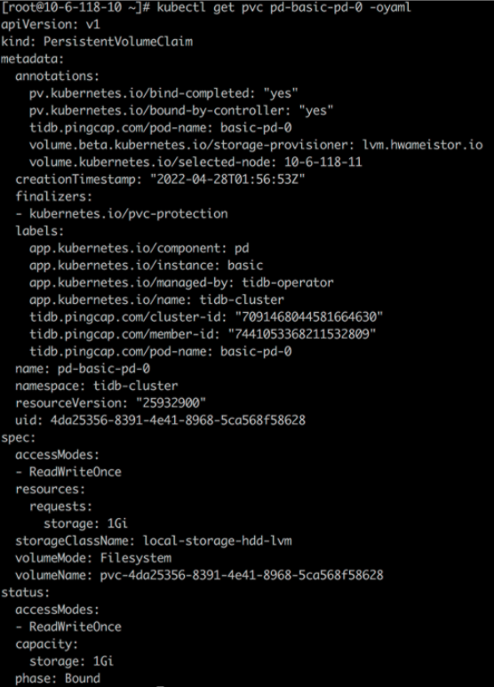


```
kubectl get po basic-tikv-0 -oyaml
```


```
kubectl get po basic-pd-0 -oyaml
```
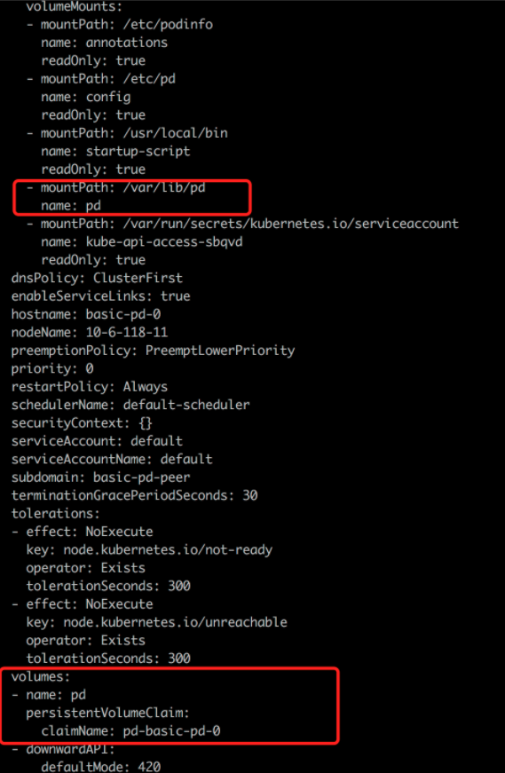

## 测试内容

### 数据库 SQL 基本能力测试

|测试项|测试结果|
|:---|:---|
|分布式事务|通过|
|对象隔离|通过|
|表操作支持（创建删除/表数据 DML/列修改增加删除/分区表）|通过|
|索引支持|通过|
|表达式|通过|
|执行计划解析|通过|
|执行计划绑定|通过|
|常用函数|通过|
|显式/隐式事务|通过|
|字符集|通过|
|锁支持|通过|
|隔离级别|通过|
|分布式复杂查询|通过|

### 系统安全测试

|测试项|测试结果 |
|:---|:---|
|账号管理与权限测试|通过|
|数据隔离|通过|
|访问控制|通过|
|白名单|通过|
|操作日志记录|通过|

### 运维管理测试

|测试项|测试结果|
|:---|:---|
|数据导入导出|通过|
|慢日志查询|通过|

有关测试详情，参考[TiDB on hwameiStor部署及测试记录](TiDBonHwameiStor.docx)。

